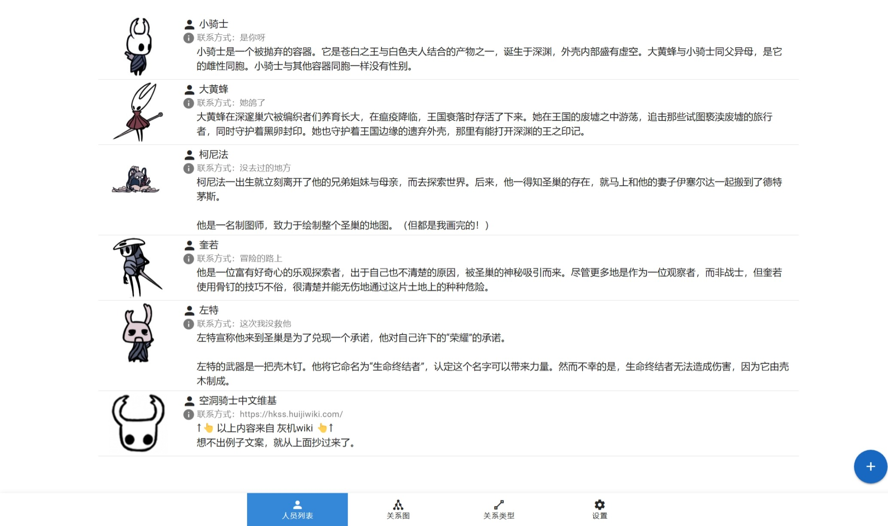
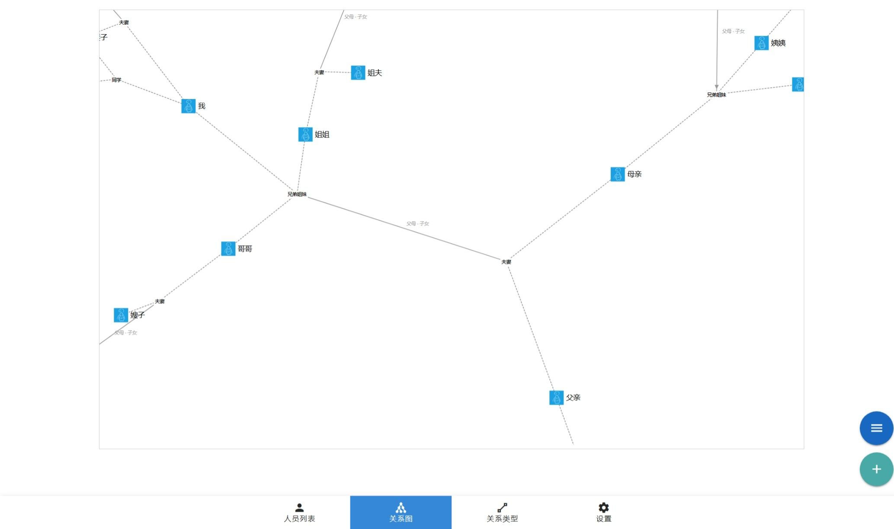

# MILation

MIZip relationship management web version.

MILation 是一个基于网页前端的人员关系管理工具。

- 管理人员信息及历史版本
- 编辑人员之间群组、个体类关系

界面如下图所示。





使用场景主要是人员较多但是又不常见的情况，每次见面需要更新信息，以及总是想不起谁是谁的时候（这会是什么场景呢😅）。

## 使用

只是简单的Vuetify应用，自行编译布署就可以了。

```bash
cd frontend && npm install
npm run build
```

都是静态文件，也可以访问<http://milation.mizip.net/>使用。

## 其它

基于网页前端数据库构建，所有信息都存在于浏览器中。
若有清除浏览器缓存习惯，在编辑大量信息前请先测试一下。

可以手动备份、恢复，没有账号、同步功能，需自行管理数据。